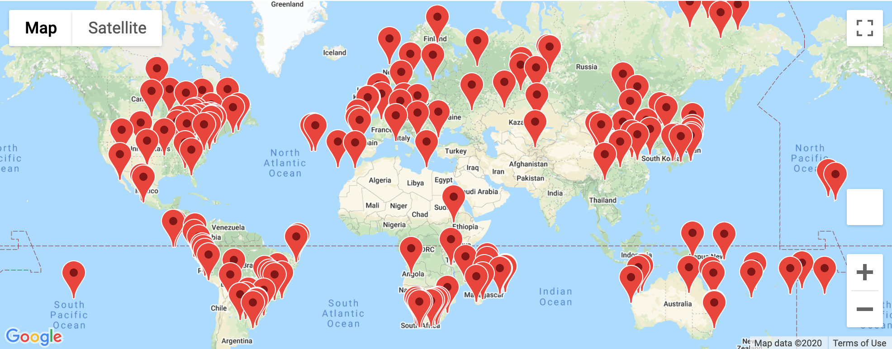
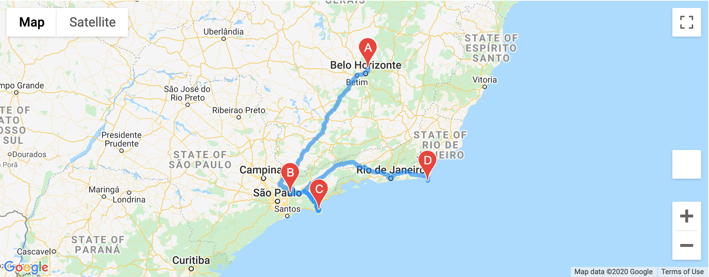
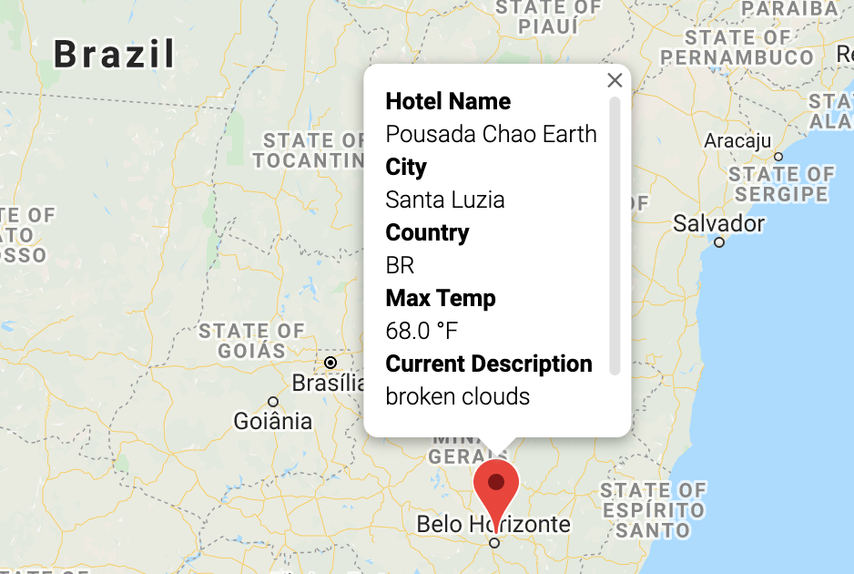
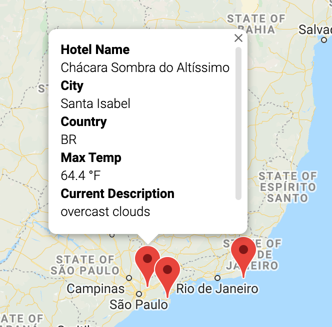
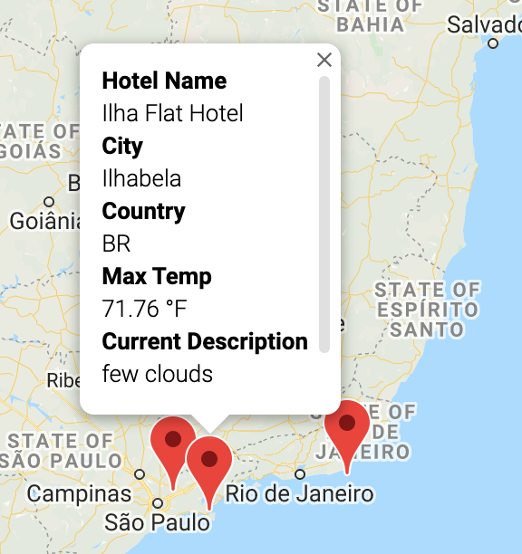
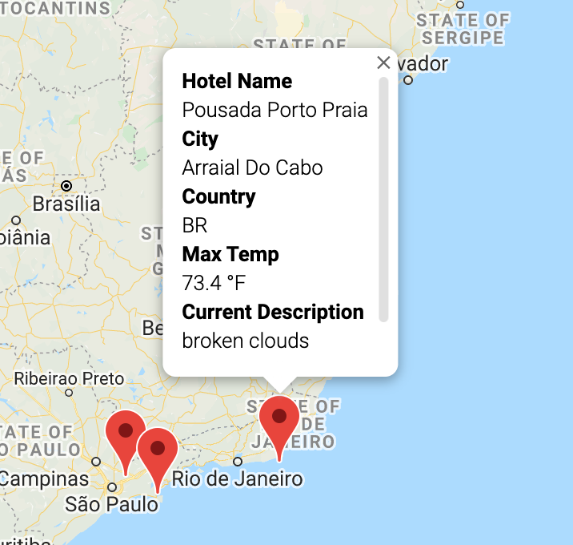

# World Weather Analysis
UC Berkeley Extension Data Analytics Boot Camp Module 6

---
## Analysis:

In this challenge, we were tasked with using Google Maps API data to generage a travel itinerary. In order to do this, we broke up the tasks into three parts:

#### Part 1: Get the Weather Description and Amount of Precipitation for Each City

To determine a vacation plan, we first generated a list of random cities and extracted weather data for them from OpenWeatherMap.com. From there, we saved the data into a CSV file that would later be used to determine cities that we could visit on vacation.

 

#### Part 2: Have Customers Narrow Their Travel Searches Based on Temperature and Precipitation

In order to ensure that a customer is able to plan a vacation that is ideal for their preferred weather conditions, we added prompts that request information from the customer. These inputs were as follows:
   - The temperature range they would like to stay within.
   - Whether they minded rain or snow during their trip.

In the challenge, we were asked how many cities reported rainfall or snowfall. At the time of my analysis, there were 72 cities with rainfall, and 0 with snowfall. 

 

In order to determine an enjoyable travel route, I chose the following parameters as my travel preferences:
- Minimum temperature: 60 degrees Farenheit
- Maximum temperature: 75 degrees Farenheit
- Open to rainfall
- Opted to not consider any cities with snowfall

 

Here is the final map of cities that fit this criteria:

 

#### Part 3: Create a Travel Itinerary with a Corresponding Map

I chose four cities in Brazil that fit our criteria listed above. Here is the final travel itinerary:

 

Here are the individual cities, as well as the hotel name and weather conditions for each city.

##### Start: The Pousada Chao Earth Hotel in Santa Luzia, Brazil

##### First Stop: The Chácara Sombra do Altíssimo Hotel in Santa Isabel, Brazil

##### Second Stop: The Ilha Flat Hotel in Ilhabela, Brazil

##### End: The Pousada Porto Praia Hotel in Arraial Do Cabo, Brazil

 
 

---
## Contents:
- "data" folder: includes CSV files created during the challenge:
   - WeatherPy_Vacation.csv
   - WeatherPy_Database.csv
   
- "images" folder: includes the images generated during the challenge:
   - WeatherPy_Vacation.png
   - WeatherPy_Travel_Map.png
   - WeatherPy_Travel_Map_Markers.png - image requested by the challenge that shows proper implementation of the map markers
   - Images created for the report, showcasing each of the points along our selected travel route:
      - Start.png
      - Stop1.png
      - Stop2.png
      - End.png
   
- Weather_Database.ipynb: Challenge Part 1 -- Create a database of cities, including weather description and amount of precipitation for each city

- Vacation_Search.ipynb: Challenge Part 2 -- Filter cities based on user-input criteria (rain, snow, and temperature range)

- Vacation_Itinerary.ipynb: Challenge Part 3 -- Create an itinerary with corresponding maps

- Other Files:
  - VacationPy.ipynb and WeatherPy.ipynb: notebooks created during the module. Parts of these were referenced when completing the challenge.
  - "weather_data" folder: includes CSV files and images created during the module:
    - cities.csv
    - image files for latitude vs. cloudiness, humidity, max temp, and wind
  ---
